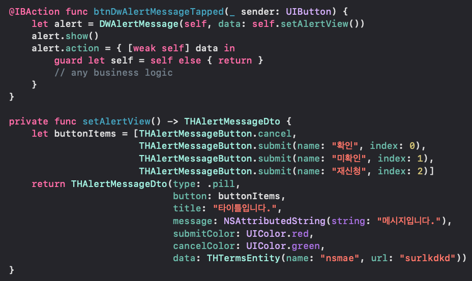

# DWAlertMessage
#### Super Easy Alert View.

# Feature
- [x] pure swift 5.0 code

# Installation

#### Swift Package Manager
Simply add DWAlertMessage to your `Package Dependancies`.

Add only url 'https://github.com/aboutyu/DWAlertMessage.git' into Package Dependancies

# Usage

You must create UIViewController and it add THAlertMessageDto.

Then you must also move to DWAlertMessage and call show() function.

If you want callback touch event, you can used closure function.

You can see as below screen.



The following sample code for your reference.

```swift
import UIKit

class ViewController: UIViewController {

    @IBAction func btnDwAlertMessageTapped(_ sender: UIButton) {
        let alert = DWAlertMessage(self, data: self.setAlertView())
        alert.show()
        alert.action = { [weak self] data in
            guard let self = self else { return }
            // any business logic
        }
    }
    
    override func viewDidLoad() {
        super.viewDidLoad()
    }

    private func setAlertView() -> THAlertMessageDto {
        let buttonItems = [THAlertMessageButton.cancel,
                           THAlertMessageButton.submit(name: "확인", index: 0),
                           THAlertMessageButton.submit(name: "미확인", index: 1),
                           THAlertMessageButton.submit(name: "재신청", index: 2)]
        return THAlertMessageDto(type: .pill,
                                 button: buttonItems,
                                 title: "타이틀입니다.",
                                 message: NSAttributedString(string: "메시지입니다."),
                                 submitColor: UIColor.red,
                                 cancelColor: UIColor.green,
                                 data: THTermsEntity(name: "nsmae", url: "surlkdkd"))
    }
}
```

# License

DWAlertMessage is available under the MIT license. See the LICENSE file for more info.
